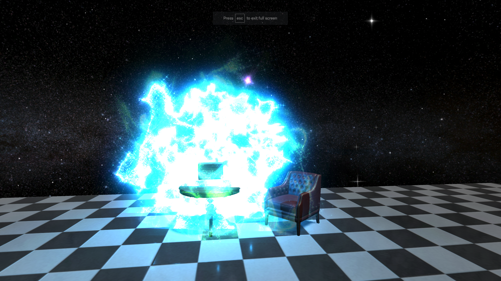

# DarkMatterRadio

## What is it

You can experience the Dark Matter Radio demo at [http://thedarkmatterradio.com/](thedarkmatterradio.com).

This is a work in progress, started in mid-2017.

The idea behind this project is to create an interactive, 3-dimensional album experience. Each song provides an interactive narritive to help the user engage with the songs in a deeper, more meaningful way. 

The songs are self produced by the project author Alex Conner and brother Eric Conner. As more music is released, more of the project content will be created to accompany it. 

This demo currently runs as a Unity WebGL project hosted online, but will hopefully be one day ported to a VR experience.

  

  

